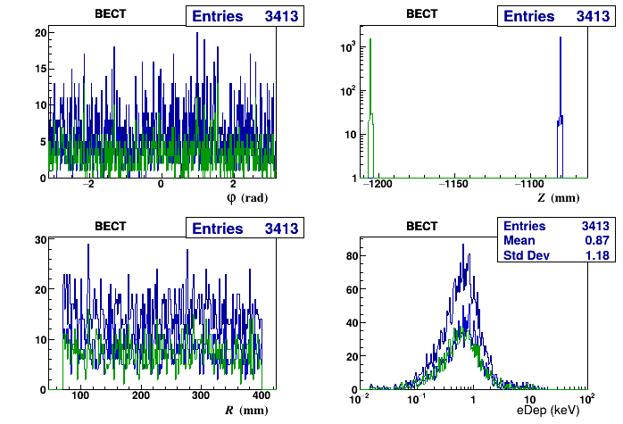
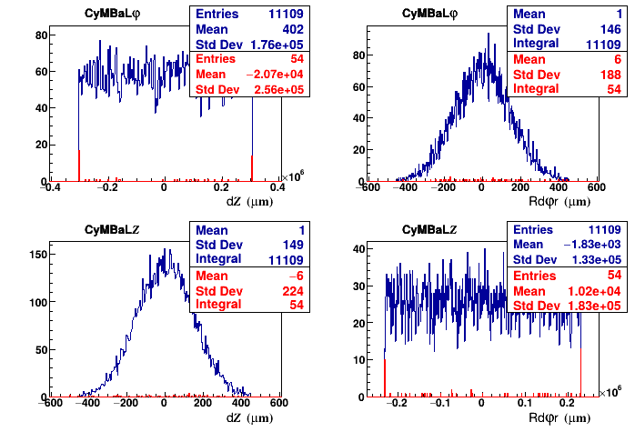

<style type="text/css">
red { color: #d02; font-family: monospace}
</style>

## recoEvents: Project the `events` TTree of the `podio_output` of `eicrecon`

### Contents
 - [Installation](#installation)
 - [Usage](#usage)
   - [Loading](#load-shared-lib)
   - [Instantiate](#instantiate)
   - [Loop on events](#loop-on-events)
   - [Draw histos](#draw-histos)
   - [Event control, debugging:](#event-control-debugging)
   - [Subvolumes](#subvolumes)
   - [Instantiate a second recoEvents object:](#instantiate-a-second-recoevents-object)
   - [ROOT file system](#root-file-system)
   - [Examples](#examples)

### Installation
```
eic-shell
mkdir build; mkdir install; cd build
cmake -DCMAKE_INSTALL_PREFIX=../install -DCMAKE_BUILD_TYPE=Debug ..
make
make install
```

### Usage
 From the ROOT command line:

#### Load shared lib:
```
.L ../recoEvents/install/librecoEvents.so
```
#### Instantiate:

`TFile *_file0 = TFile::Open("podio_output.root");`<BR>
`TTree *events = (TTree*)gDirectory->Get("events");`<BR>
<red>`// Instantiate a recoEvents object w/ as arg.s:`</red><BR>
<red>`// - pointer to events TTree`</red><BR>
<red>`// - bit pattern: 0x1:CyMBaL, 0x2:Outer, 0x4: BECT, 0x8: FECT, 0x10:Vertex, 0x20:Si.`</red><BR>
`recoEvents ana(events,0xf);`

#### Loop on events:
```
ana.Loop();
```
#### Draw histos:

`ana.DrawphithZR(0,0x1);`&nbsp;&nbsp;&nbsp; <red>// TCanvas of SimHits of 0x1:CyMBaL...</red><BR>
`ana.DrawphithZR(0,0x1,1);` <red>// ...same w/ some decorations</red><BR>
`ana.DrawphithZR(0,0x2,1);` <red>// ...same for SimHits of 0x2:Outer</red><BR>
`ana.DrawResiduals(0x1);`&nbsp;&nbsp;&nbsp; <red>// (RecHit-SimHit) residuals for 0x1:CyMBaL</red>

`new TCanvas("c2D");`<BR>
`ana.recHs[0].XY->Draw();`  <red>// Draw Y vs. X for RecHits of [0]:CyMBal</red><BR>
`ana.simHs[4].ZR->Draw();`  <red>// Draw R vs. Z for SimHits of [4]:Vertex</red>

#### Event control, debugging:

`ana.requirePDG = 13;`&nbsp;&nbsp;&nbsp;&nbsp; <red>// Require MCParticle = mu-</red><BR>
`ana.requireQuality = 2;`                 <red>// !=0: Require primary. >1: In addition, reject hits w/ interfering secondary in same module.</red><BR>
`ana.verbose = 0x1111;`&nbsp;&nbsp;&nbsp; <red>// Debugging printout (1 for CyMBaL, 2 for Outer...)</red>

`ana.select = new TTreeFormula("select", "@MCParticles.size()==1", events);` <red>// Add rejection cut</red>

#### Subvolumes:
 - 5-SUBVOLUME is default. SimHits from MPGDs are coalesced alla MPGDTrackerDigi.
 - Enforce single-SUBVOLUIME:

`recoEvents ana(events,0xf,0x0);` <red>// Instantiate w/ no strips (_i.e._ w/ pixels) in CyMBaL and Outer</red><BR>
`ana.SetNSensitiveSurfaces(1);` &nbsp;&nbsp; <red>// Overwrite default.</red>

#### Instantiate a second recoEvents object:
```
TFile *_file0 = TFile::Open("podio_output.2.root");
TTree *event2 = (TTree*)gDirectory->Get("events");
recoEvents ana2(event2,0x1);
```

#### ROOT file system:
 Histos can also be accessed and listed from the ROOT file system.

#### Examples

 - SimHits
   - Generation
   ```
   npsim --steeringFile examples/steeringFile.py --compactFile $DETECTOR_PATH/epic_craterlake_tracking_only.xml \\
     -G -v ERROR -N $num --random.seed 1234 -O edm4hep.example.1234.root
   
   ```
   - Projection
  ```
 .L ~/eic/recoEvents/install/librecoEvents.so 
 TFile *_file0 = TFile::Open("edm4hep.example.1234.root")
 TTree *t = (TTree*)gDirectory->Get("events");
 recoEvents ana1(t,0x3f,0x3);
 ana1.Loop();
 ana1.DrawphithZR(0,0x4,0x1d,true);
  ```
 
 

 - (RecHits-SimHits) Residuals
   - Generation
   ```
   eicrecon -Peicrecon:LogLevel=error -Pjana:nevents=16000 -PMPGD:SiFactoryPattern=0x0 \\
     -Ppodio:output_file=podio.example.1234.root edm4hep.example.1234.root
   ```
   - Projection
   
   Residuals (RecHits-SimHits), for isolated muons, highlighting edges in red.

   ```
   TFile *_file1 = TFile::Open("podio.example.1234.root")
   TTree *t = (TTree*)gDirectory->Get("events");
   recoEvents ana2(t,0x3f,0x3), *ana = ana2;
   ana->requirePDG = 13; ana->requireQuality = 2;
   ana->Loop();
   recoEvents ana3(t,0x3f,0x3), *ana = &ana3;
   ana->requirePDG = 13; ana->requireQuality = 2;
   ana3.requireOffEdge = -1;
   ana->Loop();
   ana = &ana2;
   ana->DrawResiduals(1,0x1,0x6)
   ana->DrawResiduals(2,0x1,0x6,cCyMBaL1Res,3)
   ana = &ana3
   ana->DrawResiduals(1,0x1,0x6,cCyMBaL1Res,1,2)
   ana->DrawResiduals(2,0x1,0x6,cCyMBaL1Res,3,2)
   ```
 
 

<br><br><br><br><br><br><br><br><br>
~~~~~~~~~~~~~~~~~~~~~
